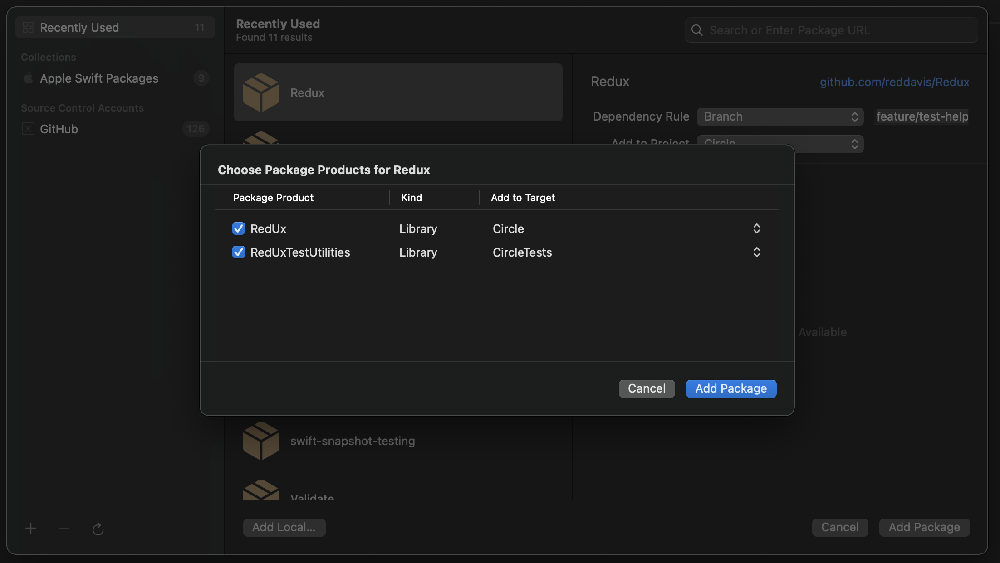

# RedUx

A super simple Swift implementation of the redux pattern making use of Swift 5.5's new async await API's. 

## Requirements

- iOS 15.0+
- macOS 12.0+

## Installation

### Swift Package Manager

In Xcode:

1. Click `Project`.
2. Click `Package Dependencies`.
3. Click `+`.
4. Enter package URL: `https://github.com/reddavis/Redux`.
5. Add `RedUx` to your app target.
6. If you want the test utilities, add `RedUxTestUtilities` to your test target.



## Documentation

Documentation can be found [here](https://determined-dubinsky-ed15d5.netlify.app/).

## Usage

### Store definition

```swift
import RedUx
import SwiftUI


enum RootScreen
{
    typealias Store = RedUx.Store<State, Event, Environment>
    
    static func make() -> some View
    {
        ContentView(
            store: Store(
                state: .init(),
                reducer: self.reducer,
                environment: .init()
            )
        )
    }
    
    static func mock(
        state: State
    ) -> some View
    {
        ContentView(
            store: Store(
                state: state,
                reducer: .empty,
                environment: .init()
            )
        )
    }
}


// MARK: Reducer

extension RootScreen
{
    static let reducer: Reducer<State, Event, Environment> = Reducer { state, event, environment in
        switch event
        {
        case .increment:
            state.count += 1
            return .none
        case .decrement:
            state.count -= 1
            return .none
        case .incrementWithDelay:
            return AsyncStream { continuation in
                // Really taxing shiz
                await Task.sleep(2 * 1_000_000_000)
                continuation.yield(.increment)
                continuation.finish()
            }.eraseToAnyAsyncSequenceable()
        }
    }
}


// MARK: State

extension RootScreen
{
    struct State: Equatable
    {
        var count = 0
    }
}


// MARK: Event

extension RootScreen
{
    enum Event
    {
        case increment
        case decrement
        case incrementWithDelay
    }
}


// MARK: Environment

extension RootScreen
{
    struct Environment { }
}

```

### View

```swift
import SwiftUI


extension RootScreen
{
    struct ContentView: View
    {
        @StateObject var store: Store
        
        // MARK: Body
        
        var body: some View {
            VStack(alignment: .center) {
                Text(verbatim: .init(self.store.count))
                    .font(.largeTitle)
                
                HStack {
                    Button("Decrement") {
                        self.store.send(.decrement)
                    }
                    .buttonStyle(.bordered)
                    
                    Button("Increment") {
                        self.store.send(.increment)
                    }
                    .buttonStyle(.bordered)
                    
                    Button("Delayed increment") {
                        self.store.send(.incrementWithDelay)
                    }
                    .buttonStyle(.bordered)
                }
            }
        }
    }
}


// MARK: Preview

struct RootScreen_ContentView_Previews: PreviewProvider
{
    static var previews: some View {
        RootScreen.mock(
            state: .init(
                count: 0
            )
        )
    }
}

```

### Tests

```swift
import XCTest
import RedUxTestUtilities
@testable import Example


class RootScreenTests: XCTestCase
{
    @MainActor
    func testStateChange() async
    {
        let store = RootScreen.Store(
            state: .init(),
            reducer: RootScreen.reducer,
            environment: .init()
        )
        
        await XCTAssertStateChange(
            store: store,
            events: [
                .increment,
                .decrement,
                .incrementWithDelay
            ],
            matches: [
                .init(),
                .init(count: 1),
                .init(count: 0),
                .init(count: 1)
            ]
        )
    }
}

```

## Other libraries

- [Papyrus](https://github.com/reddavis/Papyrus) - Papyrus aims to hit the sweet spot between saving raw API responses to the file system and a fully fledged database like Realm.
- [Asynchrone](https://github.com/reddavis/Asynchrone) - Extensions and additions to AsyncSequence, AsyncStream and AsyncThrowingStream.
- [Validate](https://github.com/reddavis/Validate) - A property wrapper that can validate the property it wraps.
- [Kyu](https://github.com/reddavis/Kyu) - A persistent queue system in Swift.
- [FloatingLabelTextFieldStyle](https://github.com/reddavis/FloatingLabelTextFieldStyle) - A floating label style for SwiftUI's TextField.
- [Panel](https://github.com/reddavis/Panel) - A panel component similar to the iOS Airpod battery panel.

## License

Whatevs.
